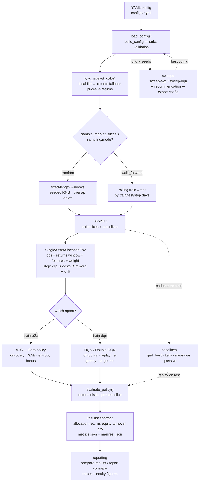

# Architecture — How the Code Works

This document explains the `rl4am` codebase: the data flow, the two reinforcement-learning
agents, the command-line entry points, and the configuration options that drive them. It
accompanies the project described in the [README](../README.md) and the article
*Reinforcement Learning for Dynamic Asset Allocation — A2C and DQN in a Random-Slice EURUSD
Case Study* (Dr. Yves J. Hilpisch).

The whole system is **one linear pipeline**. The CLI subcommands are just different entry
points into that same pipeline:

```
config → data → slices → env → agent/training → evaluation → results → reporting
```

## Pipeline at a glance



The same pipeline as a plain-text (ASCII) diagram — renders in any viewer, no Mermaid support required:

```text
+--------------------------------------------------------+
|  YAML config   (configs/*.yml)
+--------------------------------------------------------+
                             |
                             v
+--------------------------------------------------------+
|  load_config() / build_config()
|    -- strict validation of every option
+--------------------------------------------------------+
                             |
                             v
+--------------------------------------------------------+
|  load_market_data()
|    -- local file  -->  remote fallback
|    -- prices  -->  returns
+--------------------------------------------------------+
                             |
                             v
+--------------------------------------------------------+
|  sample_market_slices()          [ sampling.mode ]
|    -- random ......... fixed-length windows (seeded RNG)
|    -- walk_forward ... rolling train --> test windows
+--------------------------------------------------------+
                             |
                             v
+--------------------------------------------------------+
|  SliceSet  =  train slices  +  test slices
+--------------------------------------------------------+
                             |
                             v
+--------------------------------------------------------+
|  SingleAssetAllocationEnv
|    -- obs  = returns window + features + current weight
|    -- step = clip --> costs --> reward --> drift weight
+--------------------------------------------------------+
                             |
                             v
+--------------------------------------------------------+
|  agent training                  [ which agent? ]
|    -- train-a2c ... A2C Beta policy  (on-policy, GAE)
|    -- train-dqn ... DQN / Double-DQN (off-policy, replay)
|
|  baselines run in parallel:  grid_best / kelly /
|  mean-var / passive  -- calibrate on train, replay on test
+--------------------------------------------------------+
                             |
                             v
+--------------------------------------------------------+
|  evaluate_policy()   -- deterministic, per test slice
+--------------------------------------------------------+
                             |
                             v
+--------------------------------------------------------+
|  results/ contract
|    -- allocation / returns / equity / turnover  .csv
|    -- metrics.json + manifest.json   (schema_version 1)
+--------------------------------------------------------+
                             |
                             v
+--------------------------------------------------------+
|  reporting
|    -- compare-results / report-compare
|    -- comparison tables (CSV + LaTeX) + equity figures
+--------------------------------------------------------+

   sweeps:  sweep-a2c / sweep-dqn
            grid x seeds  -->  best (objective - stability)
            -->  recommendation  -->  export YAML  -->  config
```

## Stages

Each stage is one module under `src/rl4am/`:

1. **`config.py`** — `load_config()` reads a YAML file into frozen dataclasses; `build_config()`
   performs strict, centralized validation (reward / sampling / normalization modes, positivity,
   mutually-exclusive fields such as `riskless_rate` vs `riskless_rate_annual`). Bad settings fail
   loudly up front rather than silently later.
2. **`data.py`** — `load_market_data()` loads end-of-day prices (local file first, then a remote
   fallback to `hilpisch.com/eod_data.csv`), infers the date/price columns, and computes simple or
   log **returns** → a `MarketData` object.
3. **`slices.py`** — `sample_market_slices()` cuts the history into many short train/test windows.
   Two strategies: **`random`** (fixed-length windows drawn by a seeded RNG, overlapping or not) or
   **`walk_forward`** (rolling train→test windows that march through time).
4. **`env.py`** — `SingleAssetAllocationEnv`, the heart of the system. The **observation** is a
   window of (optionally normalized) returns + engineered features (return / volatility / trend-gap /
   drawdown over configurable lookbacks) + the current risky weight. Each `step(target_weight)`:
   clips the weight → charges `transaction_cost × turnover` and a `smoothness_penalty × Δweight²` →
   computes gross/net portfolio return → derives the **reward** → drifts the held weight forward by
   the realized return.
5. **`agents/` + `training/`** — two agents learn an allocation policy on the train slices:
   - **A2C** (`agents/a2c.py`, `training/a2c.py`): a continuous Beta(α, β) policy over the weight,
     trained **on-policy** with GAE advantages and an entropy bonus.
   - **DQN / Double-DQN** (`agents/dqn.py`, `training/dqn.py`): a discrete weight grid, trained
     **off-policy** with a replay buffer, an ε-greedy schedule, and a periodically synced target
     network.
6. **`evaluation.py` / `metrics.py`** — the trained, now **deterministic** policy is rolled forward
   on each test slice. Metrics: annualised return / volatility / Sharpe, max drawdown, terminal
   equity (252 periods/year).
7. **`baselines.py`** — constant-mix references (`grid_best`, `kelly_arithmetic`,
   `mean_variance_scaled`, `passive_long`), calibrated on train slices and replayed on test slices —
   the same train→test discipline as the agents, so comparisons are fair.
8. **`results.py`** — the **canonical result contract**. Every run writes `allocation.csv`,
   `returns.csv`, `equity.csv`, `turnover.csv`, `metrics.json`, and `manifest.json`
   (`schema_version: 1`), validated for matching columns and equal row counts.
9. **`reporting/` + `sweeps.py`** — `compare-results` / `report-compare` align two saved runs and
   build comparison tables (CSV + LaTeX) and equity figures. `sweep-a2c` / `sweep-dqn` run a grid of
   hyperparameters × seeds, select the best by an objective metric (minus a stability penalty), and
   can export a ready-to-train YAML config.

## CLI commands (entry points)

Every command prints a JSON summary to stdout; `--output-dir` also writes artifacts. `*` = required.

| Command | What it does | Key options |
|---|---|---|
| `data-summary` | Load data, print summary + performance metrics | `--config` |
| `baseline-summary` | Calibrate constant-mix baselines on train, evaluate on test | `--config` · `--grid-size` (101) · `--output-dir` |
| `train-a2c` | Train the Beta-policy A2C agent | `--config` · `--updates` · `--output-dir` · `--no-progress` |
| `train-dqn` | Train DQN / Double-DQN | `--config` · `--updates` · `--output-dir` · `--no-progress` |
| `sweep-a2c` / `sweep-dqn` | Hyperparameter sweep + analysis | `--grid-config`* · `--output-dir`* · `--jobs` · `--artifact-level {minimal,full}` · `--export-config` |
| `export-sweep-config` / `export-dqn-sweep-config` | Turn a sweep recommendation into a runnable YAML | `--grid-config`* · `--recommendation`* · `--output`* |
| `compare-results` | Compare two saved result dirs on their common span | `left` `right` · `--gross` |
| `report-compare` | Build a comparison table + equity figure | `left` `right` · `--output-dir`* · `--gross` |

## Configuration options (the branch points)

These keys decide which path the pipeline takes. See `configs/default.yml` for a fully populated
example.

| Config key | Allowed values | Effect |
|---|---|---|
| `project.device` | `auto` · `cpu` · `cuda` | Compute device (`auto` picks GPU if present) |
| `data.return_type` | `simple` · `log` | How returns are computed from prices |
| `sampling.mode` | `random` · `walk_forward` | Slice strategy (first branch in the diagram) |
| `sampling.overlap` | `true` · `false` | Allow overlapping random windows |
| `sampling.normalization` | `training_pool` · `per_slice` · `none` | Where return/feature normalization stats come from |
| `environment.reward.mode` | `log_return` · `clipped_log_return` · `sign` | Reward shaping |
| `environment.state_features.*` | `enabled`, `normalize`, lookback lists | Which engineered features enter the observation |
| `experiments.a2c.agent` | `a2c_beta` | Continuous Beta policy |
| `experiments.dqn.agent` | `dqn` · `double_dqn` | Discrete grid policy; `double_dqn` decouples action selection from valuation |
| `baselines.selection_metric` | e.g. `terminal_equity` | How the best constant-mix weight is chosen |

> **British spelling in keys/metrics:** `optimisation`, `annualised_return`, `annualised_volatility`,
> `annualised_sharpe`. The American spelling will silently miss config sections or `KeyError` on
> metrics.

## Output layout

Each training / baseline run writes a directory following the result contract:

```
results/a2c/
├── allocation.csv  returns.csv  equity.csv  turnover.csv   # aggregate path
├── metrics.json  manifest.json                             # metrics + provenance (schema_version: 1)
├── model.pt  training_history.json  slice_manifest.json    # checkpoint + training trace
├── test_slice_metrics.csv  test_slice_summary.csv          # per-slice tables
└── test_slices/
    ├── test_000/   # one result-contract dir per test slice
    ├── test_001/
    └── ...
```

Because random-slice runs are not one continuous path, comparisons are done **per slice** — point
`compare-results` / `report-compare` at the `test_slices/test_NNN/` directories, not the aggregate
root.

## Typical workflow

```
data-summary            # sanity-check the data
  → sweep-a2c / sweep-dqn   # find good hyperparameters, export a config
  → train-a2c / train-dqn   # train with that config
  → baseline-summary        # constant-mix references
  → compare-results / report-compare   # head-to-head tables + figures
```

## Determinism

Reproducibility is driven by `project.seed` (falling back to `sampling.seed`). RNGs are
`numpy.default_rng(seed)` plus `torch.manual_seed`; reproducing a run means matching both seeds.
